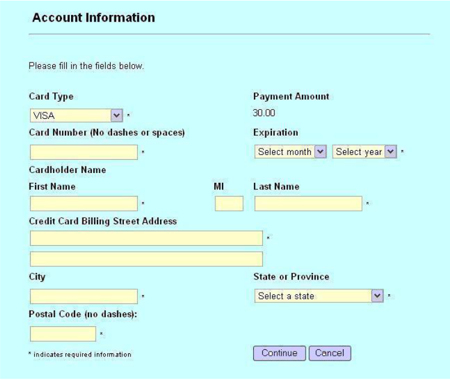

### a. Test this UI mock-up, can you find any problems with this screen? (Please pay attention to all functional aspects such as Security, Usability, Performance, etc.).

#### **Security:**
- Check if the form is using HTTPS to ensure that all data submitted is encrypted.
- It’s not clear if fields like Card Number or Expiration Date are being validated properly.
- It’s unclear if the Card Number field masks input (for example, displaying "**** **** **** 1234"). If not, this would be a significant security gap.

#### **Usability:**
- The "MI" (Middle Initial) field is misaligned and might confuse users. Its purpose is also unclear.
- Placeholders may not adequately instruct users on what information is required or the format.
- Dropdowns like "State or Province" and "Expiration Date" could slow down users. Adding a search or autocomplete feature would improve usability.
- The form does not indicate the currency for the payment amount. This can lead to confusion for users, especially those from international locations.

#### **Performance:**
-  The form doesn’t seem to support browser autofill for common fields, which could speed up user input.
- It’s not obvious if the form adjusts properly for different devices like mobile or tablets.

### b. Can you write 2–3 sample test cases for this functionality?

#### **1. Required Fields Validation:**
- **Steps:**
    1. Leave all fields blank.
    2. Click the "Continue" button.
- **Expected Result:** The form should prevent submission and highlight all required fields with error messages.

#### **2. Invalid Credit Card Number:**
- **Steps:**
    1. Enter an invalid card number, such as "1234-5678-9012-3456."
    2. Fill all other fields with valid data.
    3. Click the "Continue" button.
- **Expected Result:** The form should display an error message explaining the card number is invalid.

#### **3. Successful Submission:**
- **Steps:**
    1. Enter valid details for all fields.
    2. Click the "Continue" button.
- **Expected Result:** The form should submit successfully and navigate the user to the next step without errors.

### c. Can you suggest a product solution for the most severe bug you’ve found?
 A major issue with this form is that it doesn't validate the information as users type it in. To fix this, you could add JavaScript to perform real time validation checks on all input fields. Additionally, it would be really helpful to visually indicate errors by changing the color of input boxes or placing an icon next to them if something is wrong. This visual feedback lets users see and correct mistakes immediately, without having to wait until they submit the form. Plus, adding placeholder text in each field, like `1234567890123456` for card numbers, can guide users on the expected format, making it even easier and less frustrating to fill out the form correctly. 
 Additionally, it's crucial to display the currency next to the payment amount, like USD or ILS, to avoid confusion in international transactions.